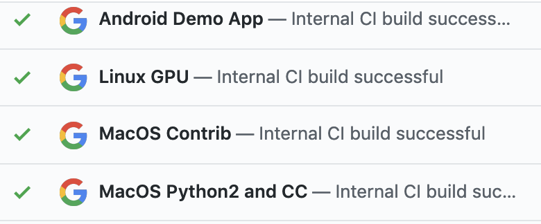
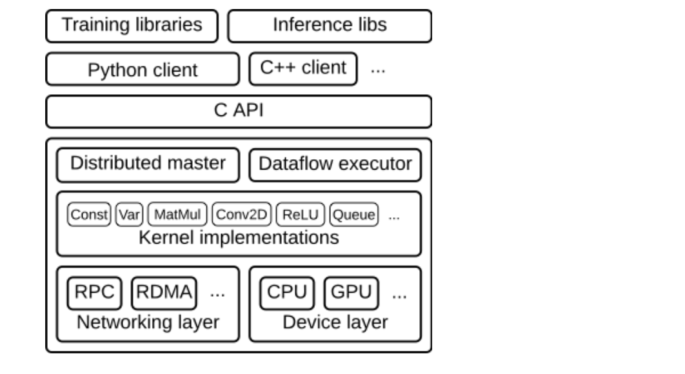
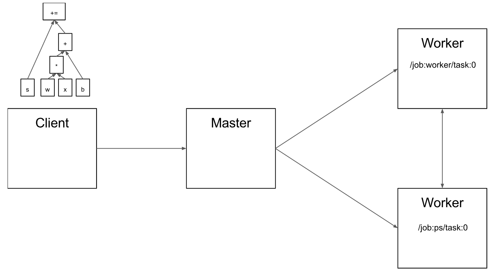
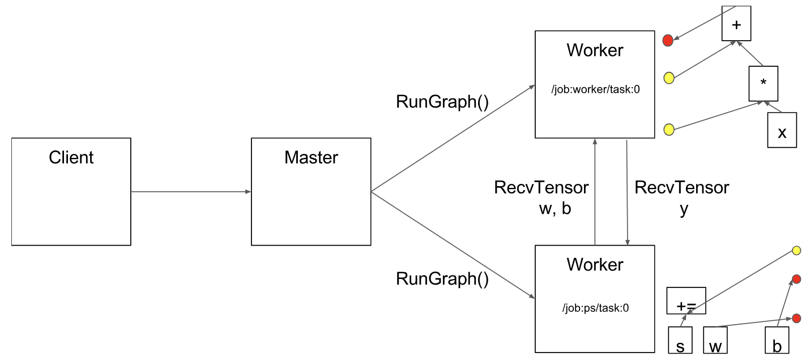
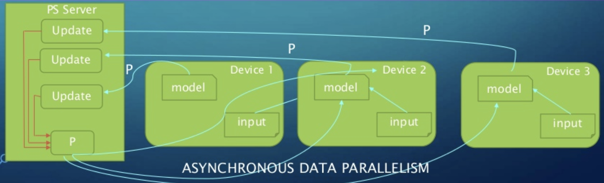

# Case-study: TensorFlow (by Leyang Shen) Updated 4.3 working on defect and demo...
## Technology and Platform used for development:
### 1. Language: 
- Tensorflow itself is a deep learning engine open sourced by Google. It was built with the C++ programming language. But in developing applications for this AI engine, coders can use either C++ or Python, the most popular language among deep learning researchers. The hope, however, is that outsiders will expand the tool to other languages, including Google Go, Java, and perhaps even Javascript, so that coders have more ways of building apps. In my opinion, I would choose to use Python for Tensorflow if starting today. Becuase Python is more acceptable and popular and much easier to comprehend nowadays. As Python is covered in most technology fields, I think it would also be easier to integrate different development tools if Tensorflow was built in Python.
### 2. Build System and Build Tools/environment:
- Tensorflow was originally created as an project at Google used by other internal teams, and Google uses a [monolithic repository](https://www.wired.com/2015/09/google-2-billion-lines-codeand-one-place/), in which all projects and all of their dependencies are built using the system on which Bazel is based (Bazel was designed to fit the way software is developed at Google...). As a result, users were able to take the existing BUILD files from their internal version, and—with a small amount of automatic modification—turn them into BUILD files that Bazel understands. There are some platforms that Bazel does not currently serve. So some [Makefiles](https://github.com/tensorflow/tensorflow/tree/7df9c6860e00b91eda0e550b11d9be52d9341d85/tensorflow/contrib/makefile) are made to cross-compile Tensorflow of iOS and Windows.

#### Build from source
- Build from source is available in Linux/macOS, Windows and Raspberry Pi. 

- User needs to install Python and Tensorflow package dependencies, install Bazel, install GPU support(optional), donwload the tensorflow source code. Configure the build, build the pip package, Docker Linux builds and Tested build configurations. The build details is attached:

[Build from source(Linux/macOS)](https://www.tensorflow.org/install/source)

[Build from source(Windows)](https://www.tensorflow.org/install/source_windows)

[Build from source(Raspberry Pi)](https://www.tensorflow.org/install/source_rpi)

- Tensorflow also provides different languages API - particular useful for loading models created with Python and running them within a different languages application.

[JAVA API](https://www.tensorflow.org/install/lang_java)

[C API](https://www.tensorflow.org/install/lang_c)

[GO API](https://www.tensorflow.org/install/lang_go)

#### What is special about Bazel that Google has to use it to develop Tensorflow?
- Multi-language support: Bazel supports Java, Objective-C and C++ out of the box, and can be extended to support arbitrary programming languages.

- High-level build language: Projects are described in the BUILD language, a concise text format that describes a project as sets of small interconnected libraries, binaries and tests. In contrast, with tools like Make, you have to describe individual files and compiler invocations.

- Multi-platform support: The same tool and the same BUILD files can be used to build software for different architectures, and even different platforms. At Google, we use Bazel to build everything from server applications running on systems in our data centers to client apps running on mobile phones.

- Reproducibility: In BUILD files, each library, test and binary must specify its direct dependencies completely. Bazel uses this dependency information to know what must be rebuilt when you make changes to a source file, and which tasks can run in parallel. This means that all builds are incremental and will always produce the same result.

- Scalable: Bazel can handle large builds; at Google, it is common for a server binary to have 100k source files, and builds where no files were changed take about ~200ms.

### 3. Framework/libraries
- The framework for Tensorflow is known for having an architecture that allows computation on any CPU or GPU, be it a desktop, a server, or even a mobile device. This framework is available in the Python programming language. The advantage of using this framwork is: 
1. Uses an easy-to-learn a language (Python);
2. Uses computational graph abstraction;
3. Availability of TensorBoard for visualization.

- Tensorflow itself is a library for machine learning and data science applications. These are libraries that can be put to use in a multitude of applications, including natural language processing / NLP (tensorflow), visualization and analysis of complex data (therano), image recognition (caffe) and prediction and recommendation. But there are more [Library & extensions](https://www.tensorflow.org/resources/libraries-extensions) of Tensorflow available.

## Testing
- The project runs builds and tests on either [Jenkins](https://jenkins.io/) or a CI (Continuous Integration) system internal to Google. The builds and tests will be triggered on each pull request and then it will show if the change passes or fails the checks.

- There is code coverage on changed file after each commit.

- Results from Jenkins are displayed in the Jenkins UI. For more information, see the [Jenkins documentation](https://jenkins.io/doc/).

- Results from the internal CI system are displayed in the Build Status UI. In this UI, to see the logs for a failed build:

1. Click on the **INVOCATION LOG** tab to see the invocation log.

2. Click on the **ARTIFACTS** tab to see a list of all artifacts, including logs.

3. Individual test logs may be available. To see these logs, from the **TARGETS** tab, click on the failed target. Then, click on the **TARGET** LOG tab to see its test log.

- Most computing platform combinations can be tested, such as Windows 10, Linux, Mac and so on.

## Software Architecture
- It is possible to build or edit functionality in Tensorflow. We can actually avoid needing to run configure script with having a bazelrc file with the necessary options in our primary project. Users can apply Tensorflow to their project by simply installing as a external library. 

- The graph below illustrates the interaction of these components.  "/job:worker/task:0" and "/job:ps/task:0" are both tasks with worker services. "PS" stands for "parameter server": a task responsible for storing and updating the model's parameters. Other tasks send updates to these parameters as they work on optimizing the parameters. This particular division of labor between tasks is not required, but is common for distributed training. The client has built a graph that applies weights (w) to a feature vector (x), adds a bias term (b) and saves the result in a variable (s).

- After running, the computation from client will be sent to the Master. The distributed master has grouped the model parameters in order to place them together on the parameter server. Then the master will insert send and receive nodes to pass information between the distributed tasks. And the computation graph will be sent over.

- The worker service end for each task will:
1. handle requests from the master,
2. schedule the execution of the kernels for the operations that comprise a local subgraph
3. mediates direct communication between tasks.

**  Red dot represents sending and yellow dot represents receving.

- While training replication between graphs, mutiple clients take part in replication. Each machine has a client which talks to the local master and gives cluster information, graphs and data to be executed. Master ensures that PS tasks are shared based on cluster and schedules tasks in local worker. Worker ensures all communication and synchronizations. Between Graphs Replication can be of two types: Synchronous and Asynchronous.

- Asynchronous:

- Tensorflow is more of a functional component for most machine learning projects. By its powerful ability of implementing algorithms, users can focus on the overall logic of the application. 

## Defects

## Demonstration

### Reference:
- https://www.wired.com/2015/11/google-open-sources-its-artificial-intelligence-engine/
- https://www.quora.com/Why-did-Google-decide-to-use-Bazel-with-TensorFlow
- https://bazel.build/faq.html#what-is-special-about-bazel
- https://www.tensorflow.org/guide/extend/architecture
